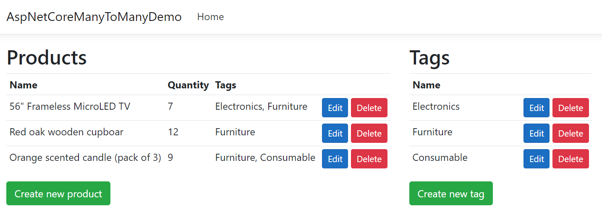

# Many to many demo with EFCore 5
This is an ASP.NET Core Razor Page application for .NET 5 which demonstrates many-to-many association between two types of entities (Products and Tags). Entity Framework Core 5 is used for persistence on a Sqlite database.

> Also check the `join-entity` branch which demonstrates the use of a join entity `ProductTag` which carries additional informations abount the association between `Product` and `Tag`.

## Getting started
Just download or clone this project, then open its folder in Visual Studio Code and press `F5` to run the application.

Click "Edit" on a product and change its association to Tags, then Save.

The interesting logic is in the Razor Page for product editing.
 * UI: [Pages/Products/Edit.cshtml](Pages/Products/Edit.cshtml)
 * Model: [Pages/Products/Edit.cshtml.cs](Pages/Products/Edit.cshtml.cs)